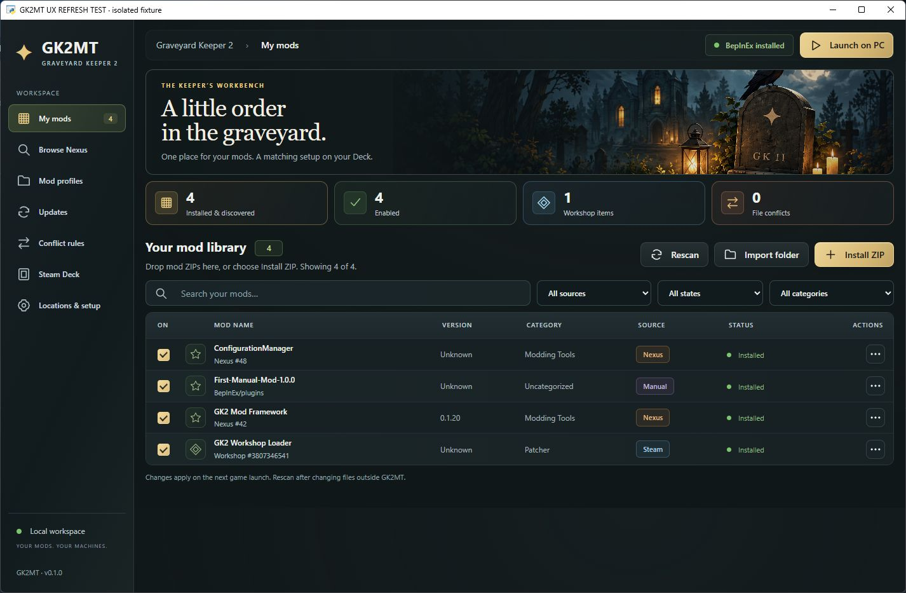
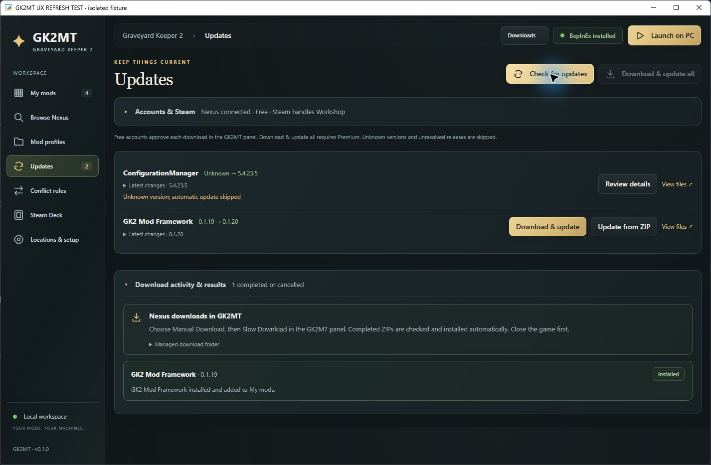
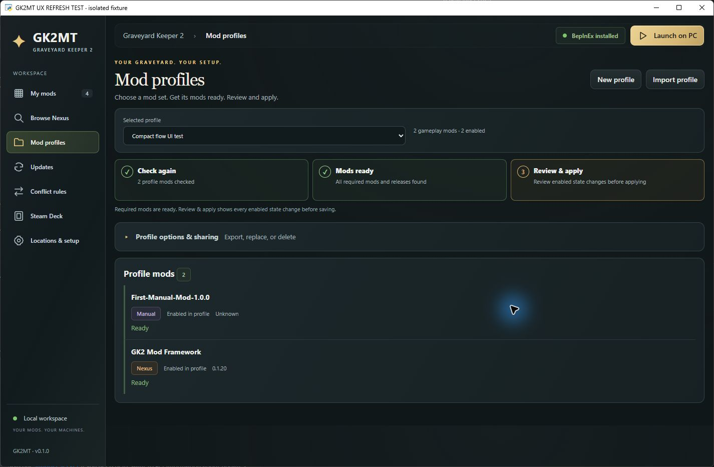
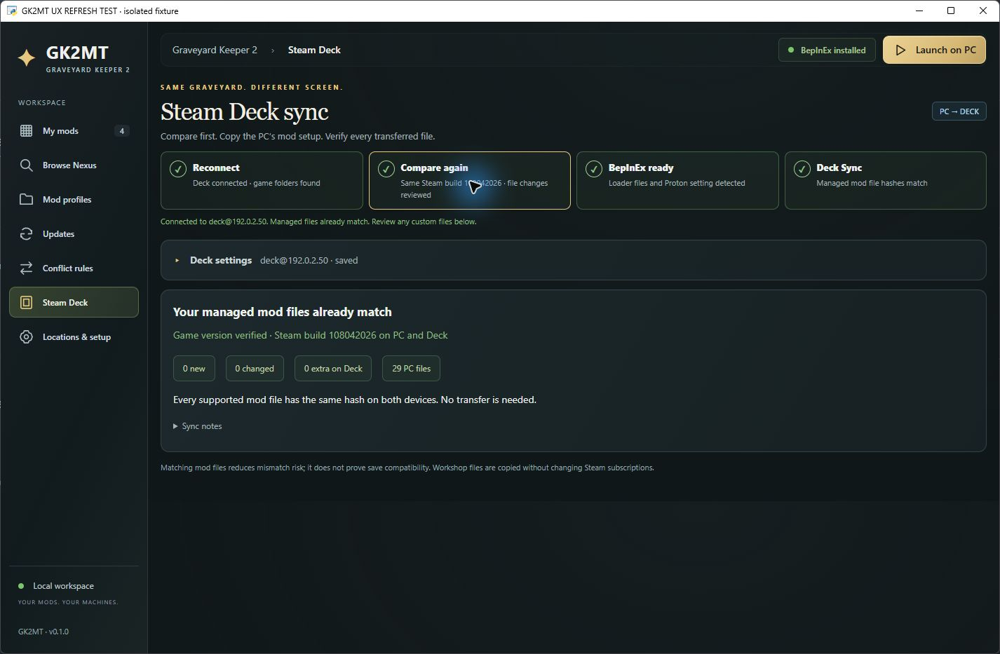

<div align="center">

# GK2MT

### Graveyard Keeper 2 Mod Toolkit

**A little order in the graveyard.**

One Windows app for your mods, profiles, updates, and matching Steam Deck setup.


[](LICENSE)


[Get started](#get-started) · [Features](#features) · [Screenshots](#screenshots) · [User guide](docs/USER-GUIDE.md) · [Build & contribute](docs/DEVELOPMENT.md)

</div>

GK2MT brings Steam Workshop, Nexus Mods, and manual ZIP installs into one mod library. It helps you set up BepInEx, install and update mods, switch shared profiles, and compare your PC with a Steam Deck before syncing. It works independently of Vortex and can recognize existing installations.

The desktop build runs as a single **GK2MT.exe** with its own window, native file pickers, and an integrated Nexus download panel. Settings and recovery backups stay in your Windows account's app-data folder.



*Screenshots show the real desktop app with demonstration data in an isolated test installation.*

## Features

| | What GK2MT does |
|---|---|
| **Quick Setup** | Detects Steam directories and checks BepInEx in a compact first-run dialog. Existing settings are filled in; Nexus and Deck setup unfold only when selected. |
| **One mod library** | Shows **Steam**, **Nexus**, and **Manual** sources, published Workshop titles, versions, categories, enabled states, and search/filter controls. |
| **Simple installation** | Drag and drop ZIPs, choose a ZIP, import a folder, or browse Nexus inside the app. Supported packages are checked before installation; identical repeat imports are skipped. |
| **BepInEx & Workshop** | Sets up the supported BepInEx bundle and guides Workshop Loader subscription, download, and installation into the game's patchers folder. |
| **Updates & changelogs** | Checks linked Nexus mods, shows the selected release's changelog, and downloads verified updates with backups. Free and Premium accounts have supported download paths. |
| **Duplicate warnings** | Warns before installing another Steam/Nexus copy of a plugin, including disabled copies, and highlights existing duplicates. |
| **File conflict rules** | Reviews overlapping imported files and sets before/after package rules with cycle detection. Disabling an override restores the previous package or original file. |
| **Mod profiles** | Saves and shares mod selections. A guided checklist resolves missing mods and release differences before you review and apply enable/disable changes. |
| **Steam Deck sync** | Connects by SSH, detects Deck folders, verifies matching game builds, previews mod differences, backs up files, syncs PC → Deck, and verifies hashes. |
| **Everyday controls** | Launches through Steam, rescans installed mods, reversibly enables/disables supported mods, and reviews Nexus/manual uninstalls with recovery backups. |
| **Private credentials** | Optionally remembers Nexus keys and Deck passwords using Windows account encryption. Profiles and mod syncs exclude credentials. |

## Get started

This repository contains the complete source and build instructions. To create the Windows executable, install **Python 3.11+**, clone or download the repository, then run from its folder:

```powershell
powershell -ExecutionPolicy Bypass -File .\Build-GK2MT.ps1
```

Open **`dist\GK2MT.exe`**. The build includes Python, SSH support, and the app's assets. Other Windows PCs need the **[Microsoft Edge WebView2 Runtime](https://developer.microsoft.com/en-us/microsoft-edge/webview2/)** but do not need Python or the source files alongside the executable.

Quick Setup opens on first use and continues until completed:

1. **Confirm directories.** GK2MT detects Steam libraries; select the game and Workshop folders if needed. The bulk ZIP folder defaults to `%USERPROFILE%\Downloads\GK2MT`.
2. **Check mod support.** Existing BepInEx is recognized. For a new setup, install the [supported BepInEx bundle](https://www.nexusmods.com/graveyardkeeper2/mods/48) or select its downloaded ZIP. For Workshop mods, open the loader's Steam page, subscribe, wait for Steam, then choose **Refresh & install loader**.
3. **Connect optional services.** Add your own Nexus API key for metadata and verified downloads, or enter Deck connection details. Either can be configured later.
4. **Finish setup and add mods.** Drop a supported ZIP onto the window, use **Install ZIP**, or open **Browse Nexus**.

Close the game before installing, updating, uninstalling, or syncing mods. After setup, launch it to confirm loading and approve Workshop mods if the loader requests it.

For running directly from source:

```powershell
python -m pip install -r requirements.txt
python app.py
```

See the [user guide](docs/USER-GUIDE.md) for step-by-step use and the [development guide](docs/DEVELOPMENT.md) for isolated testing and build checks.

## Nexus and Steam downloads

**Browse Nexus** opens the official mod site in GK2MT. Choose a mod and its Manual Download; the app captures the completed ZIP, verifies its release, installs the supported package, and adds it to your library. Duplicate copies pause for review; unsupported packages are rejected with an explanation.

| Source/account | Update experience |
|---|---|
| **Nexus Free** | Check metadata, versions, categories, and changelogs. **Download & update** opens the integrated panel; approve **Manual Download → Slow Download**, then GK2MT verifies and installs the ZIP. |
| **Nexus Premium** | Eligible individual updates and **Download & update all** download and install directly through the API. |
| **Steam Workshop** | Steam handles subscriptions and updates. GK2MT opens Workshop pages or Steam Downloads and refreshes the local inventory afterward. |
| **Manual ZIP** | Use **Install ZIP** or **Update from ZIP** for supported archives. |

Unknown versions and ambiguous file variants are skipped by automatic updates. Hidden or unavailable Nexus mods are reported individually. Updates preserve enabled states and existing configurations; unexpected changed files stop an installation for review. A failed install can retry its verified ZIP while the download session remains active.

Your Nexus website login and personal API connection are separate. Panel downloads use `%LOCALAPPDATA%\GK2MT\nexus-downloads`, independently of the bulk import folder. No shared API key is bundled.

**Project status:** this is an open-source development preview. Public production distribution with Nexus integration requires registration under the [Nexus API policy](https://help.nexusmods.com/article/114-api-acceptable-use-policy); this project does not claim to be a registered Nexus application. See [research and integration notes](RESEARCH.md).

## Profiles you can share

Save your current selection, export its JSON profile, and share it. Profiles contain mod references, enabled states, release identifiers, and manual-plugin fingerprints; they do not contain mod archives, saves, private paths, configuration files, or credentials.

The flow is **Check mods → Get mods ready → Review & apply**. Missing Nexus mods use the download panel, Steam entries open their subscription pages, and manual entries accept ZIPs. The app shows version differences and the exact changes before applying a profile. Shared BepInEx and loader setup remain outside the profile's gameplay selection.

## Match your Steam Deck

On the Deck, set a system password if needed, enable SSH, and find its IP. GK2MT handles the Windows SSH connection and can remember the address and optionally encrypt the system password.

The page guides **Connect → Compare → BepInEx → Deck Sync**. Comparison first checks that PC and Deck have the same installed Steam game build. GK2MT can configure BepInEx's `winhttp` override in the game's existing Proton environment, then transfer the supported mod setup with backups and hash verification. Game saves remain managed by Steam Cloud.

The Deck uses the Windows game and mods through Proton. Launch it once to create the Proton environment before setup. See the [Deck setup guide](DECK-SETUP.md) for commands and troubleshooting. Deck workflows have fixture and SSH test coverage; the screenshot below uses a simulated connection, and physical Deck validation remains separate.

## Screenshots

<details>
<summary><strong>Updates — release notes, nearby actions, and collapsible account settings</strong></summary>



</details>

<details>
<summary><strong>Mod profiles — check, resolve, and review a saved selection</strong></summary>



</details>

<details>
<summary><strong>Steam Deck — one sequence of connection and sync controls</strong></summary>



*Demonstration connection using the reserved test address `192.0.2.50`.*

</details>

## Data, backups, and compatibility

- **App storage:** `%LOCALAPPDATA%\GK2MT` holds settings, encrypted credentials, downloaded packages, caches, browser sessions, and recovery backups. These files are excluded from the source repository.
- **Installation protection:** supported installs, updates, removals, and syncs create backups and validate expected files. ZIP checks validate format and paths; choose mod downloads from authors you trust.
- **Vortex migration:** existing metadata can help identify mods, but GK2MT keeps its own library and installed-version records. Avoid having two managers deploy to the same installation at once.
- **Supported formats:** BepInEx plugins/patchers and recognized ZIP layouts. Custom game-file installers, FOMOD installers, RAR, and 7z require other installation tools.
- **Rules:** package rules resolve file overwrites; BepInEx plugin dependencies control runtime load order.
- **Steam removal:** unsubscribe through Steam. GK2MT's uninstall action is for supported Nexus/manual mods and protects shared foundation files.

Detailed recovery and troubleshooting instructions are in the [user guide](docs/USER-GUIDE.md).

## Build, contribute, and license

The repository includes the desktop app, interface assets, Python/JavaScript tests, Windows build files, and the separately buildable [HotkeyManager plugin source](mods/HotkeyManager/README.md). Game assemblies, downloaded mods, compiled binaries, and personal app data are not included.

Read [DEVELOPMENT.md](docs/DEVELOPMENT.md) to build and test, [CONTRIBUTING.md](CONTRIBUTING.md) to contribute, or [open an issue](https://github.com/oldjollysanta/GK2MT/issues) with a redacted reproduction.

**GK2MT is licensed under [GNU GPLv3](LICENSE), SPDX `GPL-3.0-only`.** Dependencies and third-party mods retain their own licenses; see [third-party notices](THIRD-PARTY-NOTICES.md).

Graveyard Keeper 2, Steam, Nexus Mods, and BepInEx belong to their respective owners. GK2MT is a community project and is not affiliated with them.
